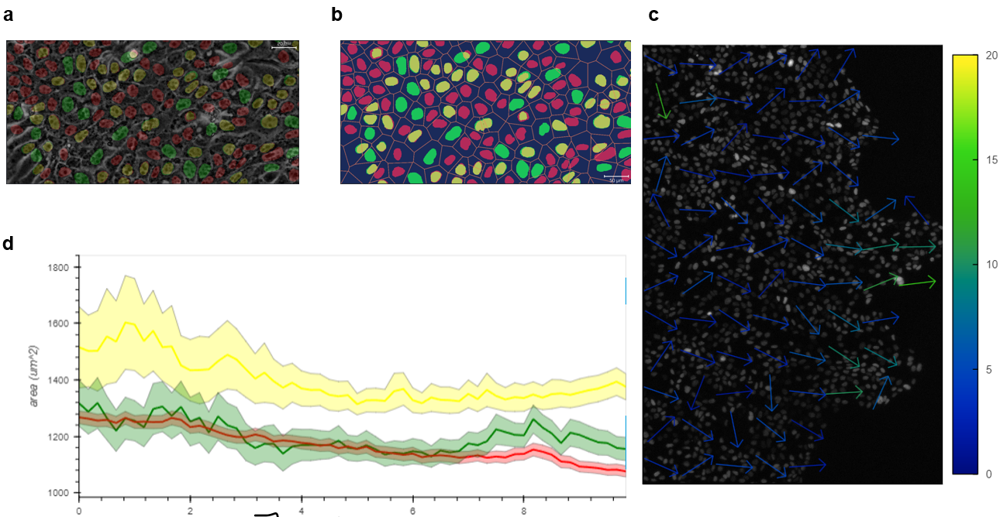

## ConfluentFUCCI

A suite of tools for analyzing large scale confluent FUCCI experiments

### Showcase

### Installation
#### Windows (no Python)
We provide the following (script)[https://github.com/leogolds/ConfluentFUCCI/install-confluentfucci-windows.bat] to simplify installation. To use, please save the script and run it as administrator.

This script will:
* Install Python 3.9, Docker Desktop
* Install ConfluentFUCCI and it's dependecies into a dedicated virtual environment
* Create a run script on your desktop to start the GUI

#### Windows/Linux (Python 3.9 installed)
In a suitable location run:

`python -m venv venv`

`. venv/bin/activate`

`python -m confluentfucci.gui`